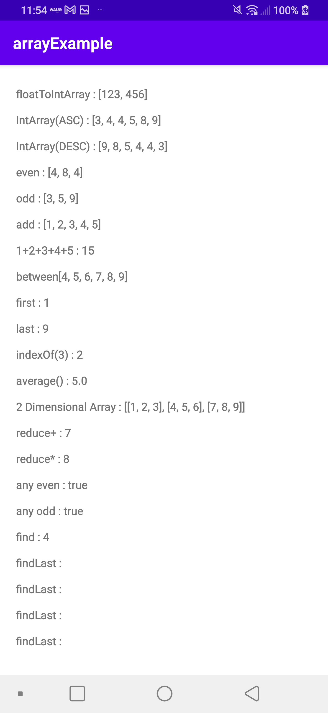

Array Example
====================
Array example

Introduction
------------

// number 를 한자씩 IntArray 에 담기  
val all: Long = 123456789  
val char: String = all.toString()  
print(  
name = "numberToIntArray : ",  
char.map {  
it.toString().toInt()  
}.toIntArray()  
)  
// => [1, 2, 3, 4, 5, 6, 7, 8, 9]  
  
// 콤마 기준으로 split  
val char2 = "123,456,789"  
print(  
    name = "comma split : ",  
    char2.split(",").map {  
        it.toInt()  
    }.toIntArray()  
)  
// => [123, 456, 789]  
  
// String 기준 한자씩 CharArray 에 담기  
val char3: String = "가나다라마바사"  
print(  
    name = "char split : ",  
    char3.toCharArray()  
)  
// => [가, 나, 다, 라, 마, 바, 사]  
  
// float 을 소수점 기준으로 나누기  
val char4: Float = 123.456.toFloat()  
print(  
    name = "floatToIntArray : ",  
    char4.toString().split(".").map {  
        it.toInt()  
    }.toIntArray()  
)  
// => [123, 456]  
  
// Int 배열 정렬 (ASC)  
val numbersSort = intArrayOf(3, 5, 9, 4, 8, 4)  
print(  
    name = "IntArray(ASC) : ",  
    numbersSort.sortedArray()  
)  
// => [3, 4, 4, 5, 8, 9]  
  
// Int 배열 정렬 (DESC)  
print(  
    name = "IntArray(DESC) : ",  
    numbersSort.sortedArrayDescending()  
)  
// => [9, 8, 5, 4, 4, 3]  
  
// 짝수 필터링  
print(  
    name = "even : ",  
    numbersSort.filter {  
        it % 2 == 0  
    }.toIntArray()  
)  
// => [4, 8, 4]  
  
// 홀수 필터링  
print(  
    name = "odd : ",  
    numbersSort.filter {  
        it % 2 != 0  
    }.toIntArray()  
)  
// => [4, 8, 4]  
  
// 1 ~ 5 까지 담기  
val numbers1 = IntArray(5) { (it + 1) }  
print(name = "add : ", numbers1)  
// => [1, 2, 3, 4, 5]  
  
// 1 + 2 + 3 + 4 + 5  
var tempNumber = 0  
numbers1.map {  
    tempNumber += it  
}  
print(name = "1+2+3+4+5 : ", tempNumber)  
// => [15]  
  
val number1 = 4  
val number2 = 9  
val total = (number2 - number1) + 1  
val numbers2 = IntArray(total)  
for ((index, i) in (number1..number2).withIndex()) {  
    numbers2[index] = i  
}  
print(  
    name = "between",  
    numbers2  
)  
// => [4, 5, 6, 7, 8, 9]  
  
val numbers3 = intArrayOf(1, 2, 3, 4, 5, 6, 7, 8, 9)  
print(name = "first : ", numbers3.first())    // 1    , 배열의 첫번째  
print(name = "last : ", numbers3.last())     // 9    , 배열의 마지막  
print(name = "indexOf(3) : ", numbers3.indexOf(3)) // 2    , 배열의 2번째  
print(name = "average() : ", numbers3.average())  // 5.0  , 배열의 평균  
  
val numbers4 = arrayOf(intArrayOf(1, 2, 3), intArrayOf(4, 5, 6), intArrayOf(7, 8, 9))  
print(name = "2 Dimensional Array : ", numbers4)  
// => [[1, 2, 3], [4, 5, 6], [7, 8, 9]]  
  
// reduce example  
val numbers5 = intArrayOf(4, 2, 1)  
// num(0) 1 =  (acc) 첫번째 엘리먼트로 시작  
// (acc) 1 + (num(1)) 2 = acc 3  
// (acc) 3 + (num(2)) 4 = acc 7 (return acc)  
print(name = "reduce+ : ", numbers5.reduce { acc, num -> acc + num })  
// => 7  
  
// num(0) 1 =  (acc) 1 첫번째 엘리먼트로 시작  
// (acc) 1 * (num(1)) 2 = acc 2  
// (acc) 2 * (num(2)) 4 = acc 8 (return acc)  
print(name = "reduce* : ", numbers5.reduce { acc, num -> acc * num })  
// => 8  
  
Getting Started
---------------

Screenshots
-----------

Support
-------

- Stack Overflow:
  - https://kotlinlang.org/docs/basic-types.html#arrays
  - https://zetcode.com/kotlin/arrays/

